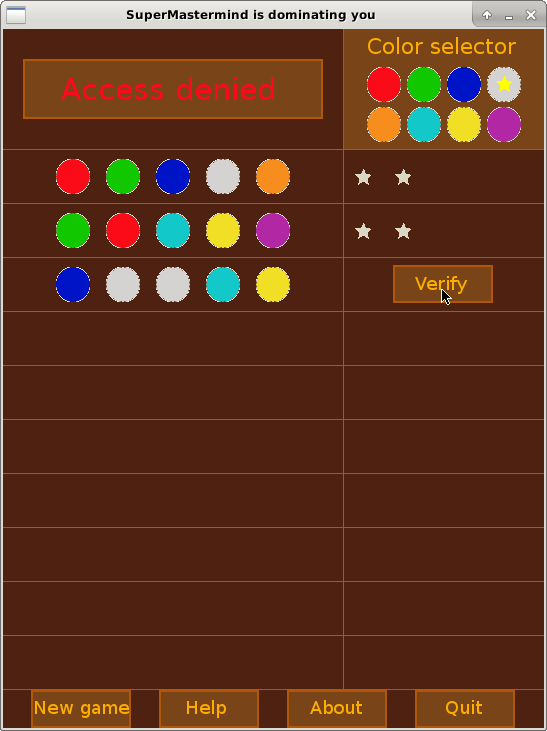
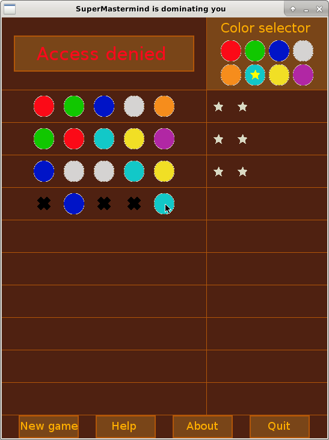
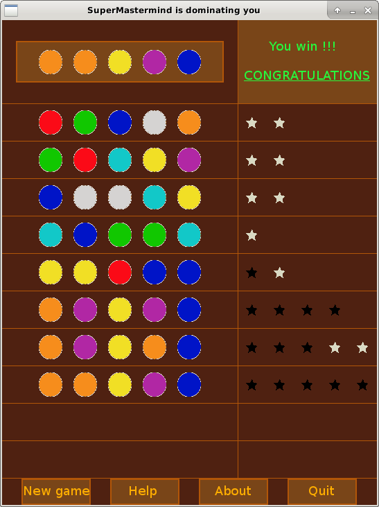

# SuperMastermind

SuperMastermind is like the famous game "Mastermind", but with 5 secret colors instead of 4. Because with 4 colors is too easy. Will you succeed in finding the code? Can your mind be strong enougth to beat me? I don't think so, because I'm the SuperMastermind, the most powerfull brain in the whole universe!!!

## Build

You need [SDL 1.2](http://libsdl.org) to build this project. Once it is installed on your system, you can type :

    $ git clone https://github.com/thaddeus002/SuperMastermind.git
    $ cd SuperMastermind
    $ make

## Rules

The game's aim is to discover a secret code composed by 5 colors (they are not necessary all different). You have ten attemps. After each attemp, you have a black star for each color at the exact place, and a white star for each color misplaced. Good luck.

## Open source

This is free software. See [LICENSE](LICENSE) file.
